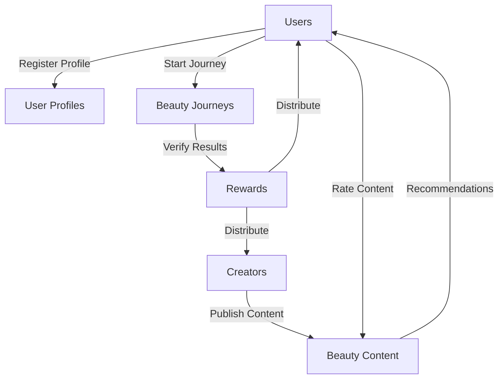

# Stacks Beauty Protocol

A decentralized ecosystem connecting beauty content creators with users seeking personalized skincare and makeup recommendations.

## Overview

The Stacks Beauty Protocol creates a trusted platform where:
- Content creators can publish beauty tutorials, recommendations, and personalized routines
- Users receive personalized beauty recommendations based on their skin type and concerns
- Both creators and users earn rewards through active participation and verified results
- A reputation system ensures high-quality beauty advice

## Architecture

The protocol is built around several key components that work together to create a self-sustaining beauty ecosystem:



### Core Components
- **User Profiles**: Stores user preferences, skin types, and concerns
- **Creator Profiles**: Tracks creator reputation and content metrics
- **Beauty Content**: Manages tutorials, recommendations, and routines
- **Beauty Journeys**: Records user progress and results
- **Reward System**: Incentivizes quality content and verified results

## Contract Documentation

### Main Contract: beauty-protocol.clar

The main contract handles all core protocol functionality including:

#### User Management
- User profile registration and updates
- Creator registration
- Reputation tracking

#### Content Management
- Content publication
- Rating system
- Recommendation matching

#### Journey Tracking
- Beauty journey creation and completion
- Result verification
- Reward distribution

## Getting Started

### Prerequisites
- Clarinet
- Stacks wallet

### Installation
1. Clone the repository
2. Install dependencies with Clarinet
3. Deploy contracts to local Clarinet chain

### Basic Usage

Register as a user:
```clarity
(contract-call? .beauty-protocol register-user-profile 
    "combination" 
    (list "acne" "aging") 
    (list "hydration" "anti-aging")
)
```

Register as a creator:
```clarity
(contract-call? .beauty-protocol register-as-creator)
```

Publish content:
```clarity
(contract-call? .beauty-protocol publish-content
    "Summer Skincare Routine"
    "routine"
    (list "combination" "oily")
    (list "acne" "sun-protection")
    (list "hydration")
)
```

## Function Reference

### User Functions

```clarity
(register-user-profile (skin-type (string-ascii 20)) (concerns (list 5 (string-ascii 20))) (goals (list 3 (string-ascii 20))))
(update-user-profile (skin-type (string-ascii 20)) (concerns (list 5 (string-ascii 20))) (goals (list 3 (string-ascii 20))))
(rate-content (content-id uint) (rating uint))
(start-beauty-journey (content-id uint))
(complete-beauty-journey (journey-id uint) (result-rating uint))
(withdraw-user-rewards)
```

### Creator Functions

```clarity
(register-as-creator)
(publish-content (title (string-ascii 100)) (content-type (string-ascii 20)) (skin-types (list 5 (string-ascii 20))) (concerns (list 5 (string-ascii 20))) (goals (list 3 (string-ascii 20))))
(withdraw-creator-rewards)
```

### Read-Only Functions

```clarity
(get-user-profile (user principal))
(get-creator-info (creator principal))
(get-content (content-id uint))
(get-recommendations (user principal) (limit uint))
```

## Development

### Testing
Run tests using Clarinet:
```bash
clarinet test
```

### Local Development
1. Start Clarinet console:
```bash
clarinet console
```

2. Deploy contracts:
```clarity
(contract-call? .beauty-protocol ...)
```

## Security Considerations

### Access Control
- Only registered creators can publish content
- Users can only rate content once
- Reward withdrawals are restricted to earned amounts

### Input Validation
- Skin types, concerns, and goals are validated against predefined lists
- Ratings must be within valid ranges (1-5)
- Content IDs and journey IDs are internally managed

### Rate Limiting
- Creator registration requires a fee
- Beauty journeys require verification for rewards
- Reputation scores affect reward calculations

### Known Limitations
- Content recommendations require off-chain indexing for scalability
- Token transfers are simulated (implement actual token contract in production)
- Journey verification could be enhanced with additional proof mechanisms